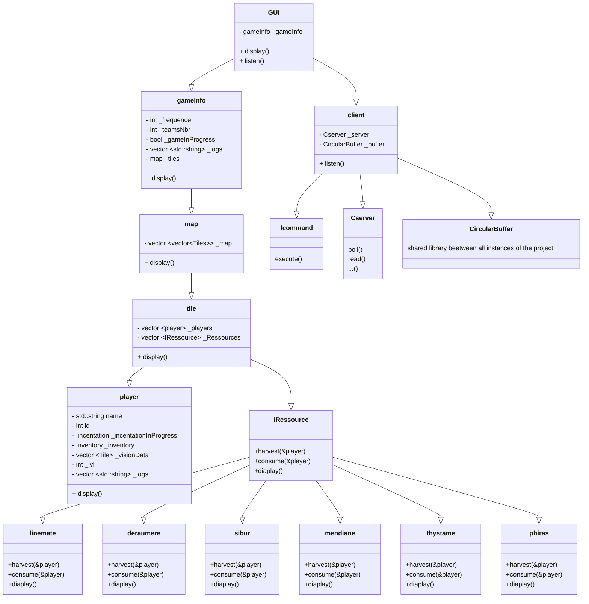

# GUI DOCUMENTATION

### uml sheme

```mermaid
classDiagram
    class GUI {
        + display()
        + listen()
        - gameInfo _gameInfo
    }

    class gameInfo {
        - int _frequence
        - int _teamsNbr
        - bool _gameInProgress
        - vector ~std::string~ _logs
        - map _tiles
        + display()
    }

    class map {
        - vector ~vector~Tiles~~ _map
        + display()
    }

    class tile {
        - vector ~player~ _players
        - vector ~IRessource~ _Ressources
                + display()

    }
    class player {
        - std::string name
        - int id
        - Iincentation _incentationInProgress
        - Inventory _inventory
        - vector ~Tile~ _visionData
        - int _lvl
        - vector ~std::string~ _logs
        + display()
    }
    class IRessource {
        +harvest(&player)
        +consume(&player)
        +diaplay()
    }
    class linemate {
        +harvest(&player)
        +consume(&player)
        +diaplay()
    }
    class deraumere {
        +harvest(&player)
        +consume(&player)
        +diaplay()
    }
    class sibur {
        +harvest(&player)
        +consume(&player)
        +diaplay()
    }
    class mendiane {
        +harvest(&player)
        +consume(&player)
        +diaplay()
    }
    class phiras {
        +harvest(&player)
        +consume(&player)
        +diaplay()
    }
    class thystame {
        +harvest(&player)
        +consume(&player)
        +diaplay()
    }
    class Icommand {
        execute()
    }
    class Cserver {
        poll()
        read()
        ...()
    }
    class client {
        - Cserver _server
        - CircularBuffer _buffer
        + listen()
    }
    class CircularBuffer {
        shared library beetween all instances of the project
    }
    GUI --|> gameInfo
    gameInfo --|> map
    map --|> tile
    tile --|> player
    tile --|> IRessource
    IRessource --|> linemate
    IRessource --|> deraumere
    IRessource --|> sibur
    IRessource --|> mendiane
    IRessource --|> thystame
    IRessource --|> phiras
    GUI --|> client
    client --|> Icommand
    client --|> Cserver
    client --|> CircularBuffer

```

an egg is a player who has a lvl of -1, and in incentation prossessing to lvl 0;

