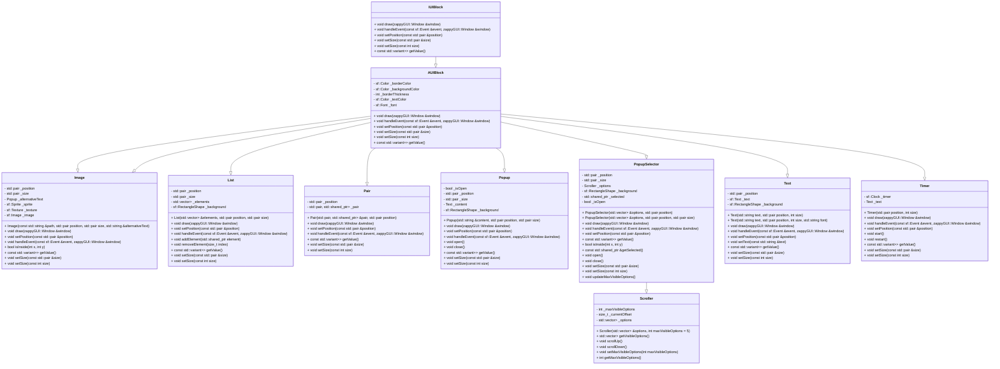

# UI Blocks documentation

### UML scheme

```mermaid
classDiagram
    class IUIBlock {
        + void draw(zappyGUI::Window &window)
        + void handleEvent(const sf::Event &event, zappyGUI::Window &window)
        + void setPosition(const std::pair<float, float> &position)
        + void setSize(const std::pair<float, float> &size)
        + void setSize(const int size)
        + const std::variant<std::string, std::vector<std::shared_ptr<IUIBlock>>> getValue()
    }

    class AUIBlock {
        + void draw(zappyGUI::Window &window)
        + void handleEvent(const sf::Event &event, zappyGUI::Window &window)
        + void setPosition(const std::pair<float, float> &position)
        + void setSize(const std::pair<float, float> &size)
        + void setSize(const int size)
        + const std::variant<std::string, std::vector<std::shared_ptr<IUIBlock>>> getValue()
        - sf::Color _borderColor
        - sf::Color _backgroundColor
        - int _borderThickness
        - sf::Color _textColor
        - sf::Font _font
    }

    class Image {
        - std::pair<float, float> _position
        - std::pair<float, float> _size
        - Popup _alternativeText
        - sf::Sprite _sprite
        - sf::Texture _texture
        - sf::Image _image
        + Image(const std::string &path, std::pair<float, float> position, std::pair<float, float> size, std::string &alternativeText)
        + void draw(zappyGUI::Window &window)
        + void setPosition(const std::pair<float, float> &position)
        + void handleEvent(const sf::Event &event, zappyGUI::Window &window)
        + bool isInside(int x, int y)
        + const std::variant<std::string, std::vector<std::shared_ptr<IUIBlock>>> getValue() 
        + void setSize(const std::pair<float, float> &size)
        + void setSize(const int size)
    }

    class List {
        - std::pair<float, float> _position
        - std::pair<float, float> _size
        - std::vector<std::shared_ptr<IUIBlock>> _elements
        - sf::RectangleShape _background
        + List(std::vector<std::shared_ptr<IUIBlock>> &elements, std::pair<float, float> position, std::pair<float, float> size)
        + void draw(zappyGUI::Window &window)
        + void setPosition(const std::pair<float, float> &position)
        + void handleEvent(const sf::Event &event, zappyGUI::Window &window)
        + void addElement(std::shared_ptr<IUIBlock> element)
        + void removeElement(size_t index)
        + const std::variant<std::string, std::vector<std::shared_ptr<IUIBlock>>> getValue() 
        + void setSize(const std::pair<float, float> &size)
        + void setSize(const int size)
    }

    class Pair {
        - std::pair<float, float> _position
        - std::pair<std::shared_ptr<IUIBlock>, std::shared_ptr<IUIBlock>> _pair

        + Pair(std::pair<std::shared_ptr<IUIBlock>, std::shared_ptr<IUIBlock>> &pair, std::pair<float, float> position)
        + void draw(zappyGUI::Window &window)
        + void setPosition(const std::pair<float, float> &position)
        + void handleEvent(const sf::Event &event, zappyGUI::Window &window)
        + const std::variant<std::string, std::vector<std::shared_ptr<IUIBlock>>> getValue()
        + void setSize(const std::pair<float, float> &size)
        + void setSize(const int size)
    }

    class Popup {
        - bool _isOpen
        - std::pair<float, float> _position
        - std::pair<float, float> _size
        - Text _content
        - sf::RectangleShape _background

        + Popup(std::string &content, std::pair<float, float> position, std::pair<float, float> size)
        + void draw(zappyGUI::Window &window)
        + void setPosition(const std::pair<float, float> &position)
        + void handleEvent(const sf::Event &event, zappyGUI::Window &window)
        + void open()
        + void close()
        + const std::variant<std::string, std::vector<std::shared_ptr<IUIBlock>>> getValue()
        + void setSize(const std::pair<float, float> &size)
        + void setSize(const int size)
    }

    class PopupSelector {
        - std::pair<float, float> _position
        - std::pair<float, float> _size
        - Scroller _options
        - sf::RectangleShape _background
        - std::shared_ptr<IUIBlock> _selected
        - bool _isOpen

        + PopupSelector(std::vector<std::shared_ptr<IUIBlock>> &options, std::pair<float, float> position)
        + PopupSelector(std::vector<std::shared_ptr<IUIBlock>> &options, std::pair<float, float> position, std::pair<float, float> size)
        + void draw(zappyGUI::Window &window)
        + void handleEvent(const sf::Event &event, zappyGUI::Window &window)
        + void setPosition(const std::pair<float, float> &position)
        + const std::variant<std::string, std::vector<std::shared_ptr<IUIBlock>>> getValue()
        + bool isInside(int x, int y)
        + const std::shared_ptr<IUIBlock> &getSelected()
        + void open()
        + void close()
        + void setSize(const std::pair<float, float> &size)
        + void setSize(const int size)
        + void updateMaxVisibleOptions()
    }

    class Text {
        - std::pair<float, float> _position
        - sf::Text _text
        - sf::RectangleShape _background

        + Text(std::string text, std::pair<float, float> position, int size)
        + Text(std::string text, std::pair<float, float> position, int size, std::string font)
        + void draw(zappyGUI::Window &window)
        + void handleEvent(const sf::Event &event, zappyGUI::Window &window)
        + void setPosition(const std::pair<float, float> &position)
        + void setText(const std::string &text)
        + const std::variant<std::string, std::vector<std::shared_ptr<IUIBlock>>> getValue()
        + void setSize(const std::pair<float, float> &size)
        + void setSize(const int size)
    }

    class Timer {
        - sf::Clock _timer
        - Text _text

        + Timer(std::pair<float, float> position, int size)
        + void draw(zappyGUI::Window &window)
        + void handleEvent(const sf::Event &event, zappyGUI::Window &window)
        + void setPosition(const std::pair<float, float> &position)
        + void start()
        + void restart()
        + const std::variant<std::string, std::vector<std::shared_ptr<IUIBlock>>> getValue()
        + void setSize(const std::pair<float, float> &size)
        + void setSize(const int size)
    }

    class Scroller {
        - int _maxVisibleOptions
        - size_t _currentOffset
        - std::vector<std::shared_ptr<UIBlocks::IUIBlock>> _options

        + Scroller(std::vector<std::shared_ptr<UIBlocks::IUIBlock>> &options, int maxVisibleOptions = 5)
        + std::vector<std::shared_ptr<UIBlocks::IUIBlock>> getVisibleOptions()
        + void scrollUp()
        + void scrollDown()
        + void setMaxVisibleOptions(int maxVisibleOptions)
        + int getMaxVisibleOptions()
    }

    IUIBlock --|> AUIBlock
    AUIBlock --|> Image
    AUIBlock --|> List
    AUIBlock --|> Pair
    AUIBlock --|> Popup
    AUIBlock --|> PopupSelector
    AUIBlock --|> Text
    AUIBlock --|> Timer
    AUIBlock --|> Image
    PopupSelector --|> Scroller
```
